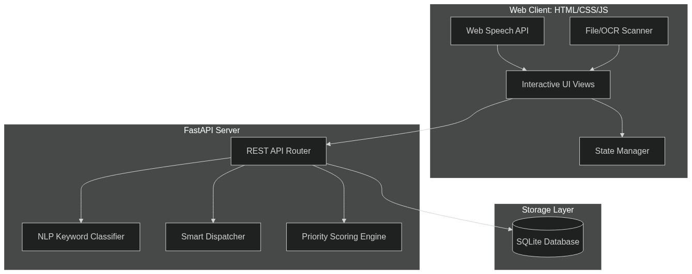

# 🏛️ HostelOps — System Architecture & Design Document

This document details the architectural design, data flows, core algorithms, and database schemas powering **HostelOps**, a smart hostel maintenance operations platform.

---

## 🗺️ High-Level System Architecture

HostelOps is built with a decoupled client-server architecture designed for high responsiveness, local offline capabilities, and instant synchronization.

---

## 🛠️ Tech Stack & Decisions

1. **Frontend (No-Framework / HTML5 / Vanilla CSS / ES6 JavaScript)**:
   * **Why**: Avoids massive node_modules dependencies, builds instantly, and operates directly in any standard browser. 
   * **State Management**: Handled via a centralized `state` dictionary in JS, enabling instant updates across different dashboard tabs.
2. **Backend (Python FastAPI & Uvicorn)**:
   * **Why**: High performance, native async support, and auto-generated OpenAPI documentation (`/docs`).
3. **Database (SQLite)**:
   * **Why**: Lightweight, serverless, and stores the state directly in a local single-file database (`hostel_maintenance.db`). Extremely fast for hackathon demos and small-to-medium deployments.

---

## 🧠 Core AI & Logic Engines

### 1. NLP Keyword & Sentiment Engine
The system uses a rule-based Natural Language Processing keyword engine on both the client-side (for instant typing previews) and the server-side (for database insertion).

* **Categories**: Plumbing, Electrical, HVAC, Furniture, Cleaning, Security.
* **Risk & Cost Weights**: Every category has pre-defined default Safety Risk, Disruption Indices, and Cost Ranges.
* **Dynamic Modifiers**: If the student's selected urgency is **High**, the safety and disruption scores are boosted (+$10$ and +$15$ points). If it is **Low**, they are reduced.

### 2. Dynamic Priority Scoring Algorithm
Rather than sorting tickets statically, HostelOps recalculates priority scores **on-the-fly** during every database query. This allows the warden to adjust sliders and see the queue re-sort instantly.

$$Priority\ Score = \frac{(Safety \times w_{safety}) + (Disruption \times w_{disruption}) + (AgeFactor \times w_{age}) + (Cost \times w_{cost})}{w_{safety} + w_{disruption} + w_{age} + w_{cost}}$$

* **Age Factor**: Time elapsed (in hours) normalized to a $0-100$ scale, capped at $48$ hours (meaning any ticket open for $\ge 48$ hours gets $100\%$ weight for age).
* **Weights ($w$)**: Ranges from $0-100$ (default: Safety = 40, Disruption = 30, Age = 20, Cost = 10).

### 3. Load-Balanced Smart Auto-Assign
The smart assignment algorithm dispenses pending tickets to specialized technicians without overloading them:
1. Filters all tickets with status `Pending`.
2. For each pending ticket, identifies all technicians whose specialty matches the ticket's category.
3. Queries their current active workloads (status `Scheduled` or `In Progress`).
4. Assigns the ticket to the technician with the **lowest active workload** (as long as they have $< 4$ active tasks).

---

## 🗄️ Database Schema Design

The SQLite database (`hostel_maintenance.db`) consists of three tables:

### 1. `tickets` Table
Stores all reported issues and their priority parameters.

| Column | Type | Constraints | Description |
| :--- | :--- | :--- | :--- |
| `id` | INTEGER | PRIMARY KEY AUTOINCREMENT | Unique identifier for each ticket |
| `room` | TEXT | NOT NULL | Room number (e.g., A-304) |
| `category` | TEXT | NOT NULL | Classified category |
| `student_urgency` | TEXT | NOT NULL | Urgency reported by student (Low/Medium/High) |
| `description` | TEXT | NOT NULL | Full ticket description |
| `age` | REAL | NOT NULL | Time elapsed in hours |
| `status` | TEXT | NOT NULL | Lifecycle status (Pending/Scheduled/In Progress/Resolved) |
| `assigned_tech` | INTEGER | FOREIGN KEY | References `technicians(id)` |
| `safety_raw` | INTEGER | NOT NULL | Base safety risk score (0-100) |
| `disruption_raw` | INTEGER | NOT NULL | Base disruption score (0-100) |
| `cost_raw` | INTEGER | NOT NULL | Base cost index (0-100) |
| `detected_keywords`| TEXT | NOT NULL | JSON array of detected NLP keywords |
| `photo_url` | TEXT | OPTIONAL | Path to uploaded verification image |

### 2. `technicians` Table
Stores registered maintenance specialists.

| Column | Type | Constraints | Description |
| :--- | :--- | :--- | :--- |
| `id` | INTEGER | PRIMARY KEY AUTOINCREMENT | Unique technician ID |
| `name` | TEXT | NOT NULL | Full name |
| `specialty` | TEXT | NOT NULL | Matching domain (e.g., Plumbing) |

### 3. `weights_config` Table
Stores configuration parameters for the AI prioritization sliders.

| Column | Type | Constraints | Description |
| :--- | :--- | :--- | :--- |
| `key` | TEXT | PRIMARY KEY | Setting key (safety/disruption/age/cost) |
| `val` | INTEGER | NOT NULL | Current weight value (0-100) |
